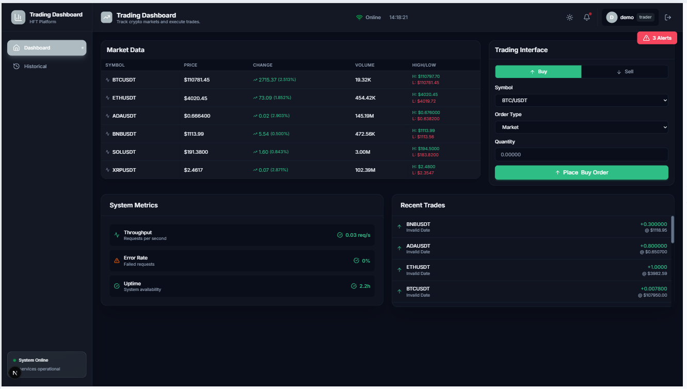
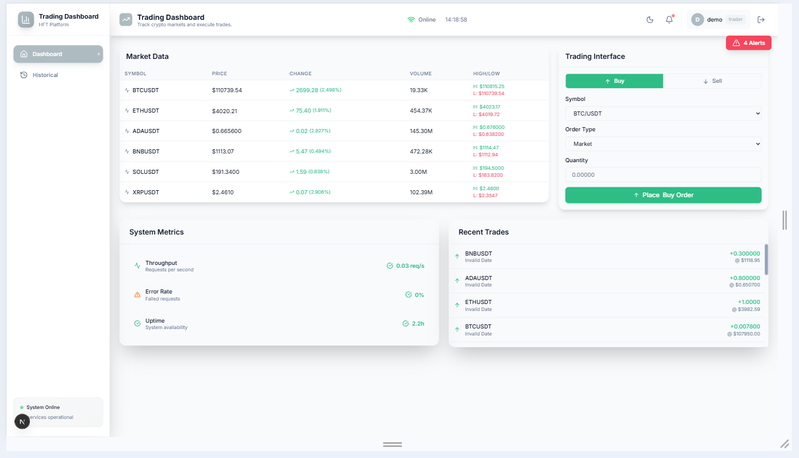
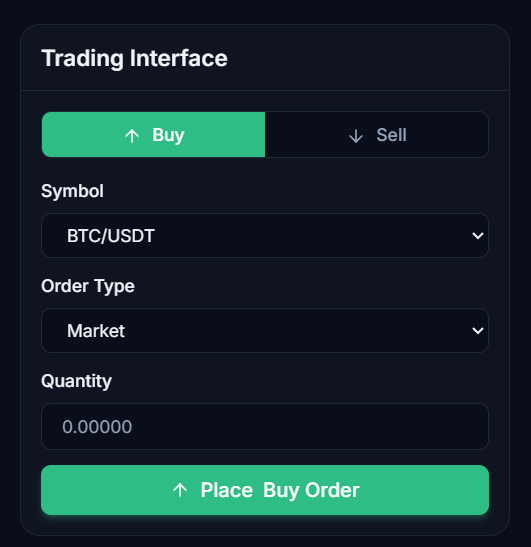
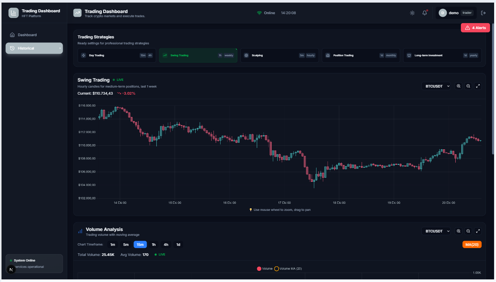
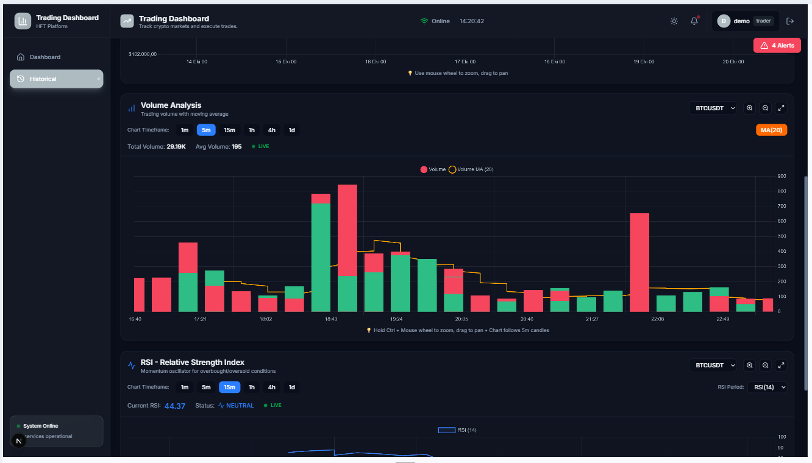
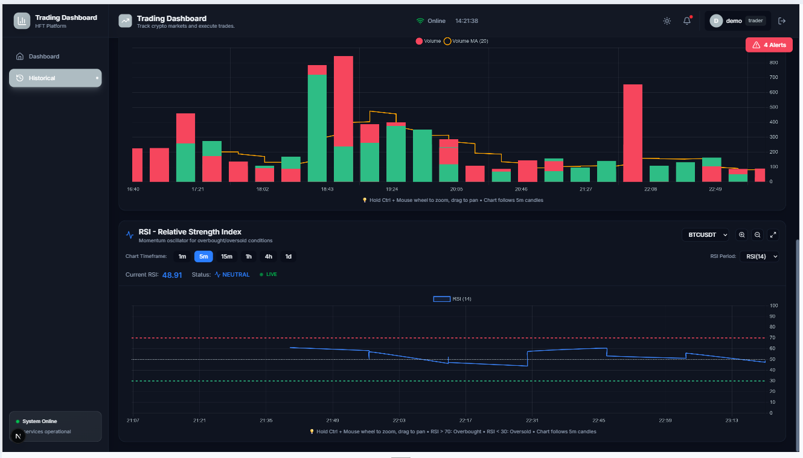
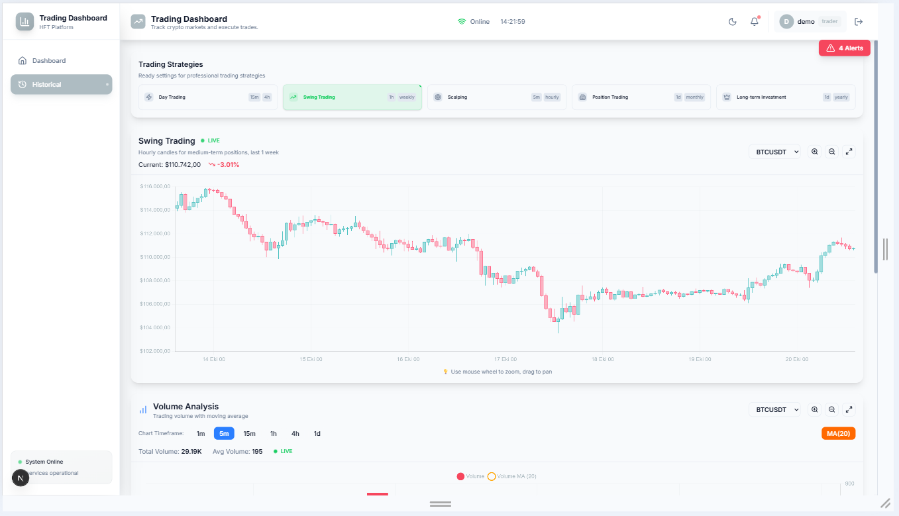
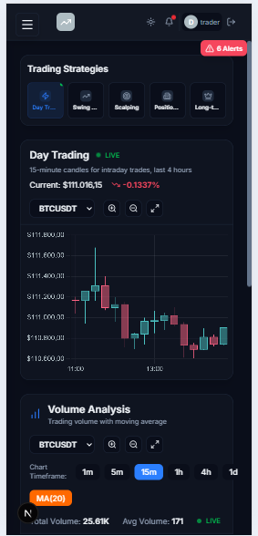
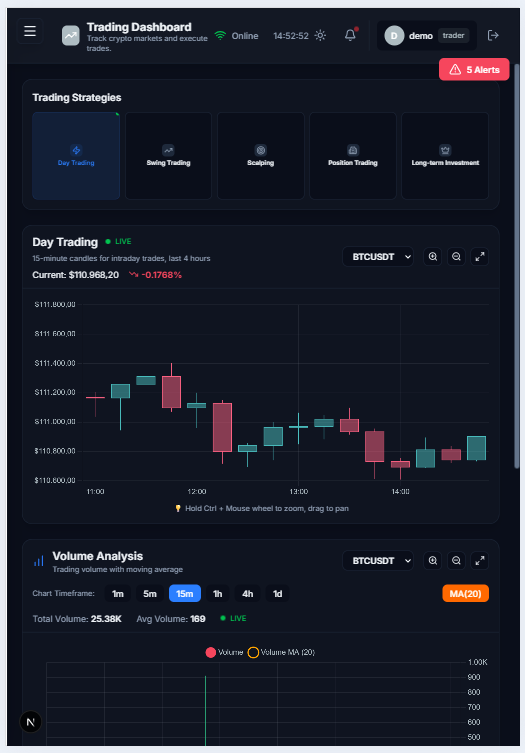

# Real-Time Trading Dashboard

A high-performance, enterprise-grade trading dashboard built for real-time market data analysis, trade execution, and system monitoring. Designed for high-frequency trading (HFT) environments with FPGA-based technology integration.


---

## Project Overview

This trading dashboard provides traders with a comprehensive platform for:

- **Real-Time Market Data Visualization** - Live price updates via WebSocket
- **Trade Execution** - Instant order placement and tracking
- **Historical Data Analysis** - ClickHouse-powered analytics
- **System Performance Monitoring** - Latency, throughput, and error tracking
- **Multi-Timeframe Charting** - Scalping to long-term investment analysis

### Key Features

- **Real-Time Updates** - Sub-second market data via Binance WebSocket
- **Advanced Charting** - Candlestick, Volume, RSI with zoom/pan support
- **Order Management** - Market & limit orders with balance tracking
- **Historical Analytics** - ClickHouse database for fast queries
- **Security** - JWT authentication, rate limiting, CORS protection
- **Performance** - Optimized React rendering, batch processing
- **Responsive Design** - Works on desktop, tablet, and mobile

---

## Architecture

```
┌─────────────────────────────────────────────────────────────┐
│                         FRONTEND                             │
│  Next.js 15 + React 19 + TypeScript + Tailwind CSS         │
│                                                               │
│  ┌──────────┐  ┌──────────┐  ┌──────────┐  ┌──────────┐   │
│  │ Trading  │  │  Charts  │  │  System  │  │   Auth   │   │
│  │Interface │  │Components│  │ Metrics  │  │ Context  │   │
│  └──────────┘  └──────────┘  └──────────┘  └──────────┘   │
│         │              │             │              │        │
└─────────┼──────────────┼─────────────┼──────────────┼────────┘
          │              │             │              │
          ▼              ▼             ▼              ▼
┌─────────────────────────────────────────────────────────────┐
│                      API GATEWAY (REST)                      │
│               Express.js + TypeScript                        │
└─────────────────────────────────────────────────────────────┘
          │              │             │              │
   ┌──────┴──────┬───────┴──────┬──────┴───────┬──────┴──────┐
   ▼             ▼              ▼              ▼             ▼
┌────────┐  ┌──────────┐  ┌──────────┐  ┌────────┐  ┌─────────┐
│Postgres│  │ClickHouse│  │  Redis   │  │Binance │  │WebSocket│
│  User  │  │Historical│  │  Cache   │  │  API   │  │  Server │
│  Data  │  │  Market  │  │   Rate   │  │  Real  │  │  Live   │
│Orders  │  │Analytics │  │ Limiting │  │  Time  │  │ Updates │
└────────┘  └──────────┘  └──────────┘  └────────┘  └─────────┘
```

See [ARCHITECTURE.md](./ARCHITECTURE.md) for detailed system design.

---

## Quick Start

### Prerequisites

- **Node.js** >= 18.0.0
- **PostgreSQL** >= 13
- **ClickHouse** >= 22
- **Redis** >= 6
- **Docker** (optional, for databases)

### Installation

1. **Clone the repository**
   ```bash
   git clone <repository-url>
   cd trading-dashboard
   ```

2. **Install dependencies**
   ```bash
   # Backend
   cd backend
   npm install

   # Frontend
   cd ../frontend
   npm install
   ```

3. **Start databases with Docker**
   ```bash
   cd backend
   docker-compose up -d
   ```

4. **Configure environment variables**
   ```bash
   # Backend: backend/.env
   cp backend/.env.example backend/.env
   # Edit with your configuration

   # Frontend: frontend/.env.local (if needed)
   ```

5. **Initialize databases**
   ```bash
   # PostgreSQL migrations (automatic on first run)
   # ClickHouse schema
   docker exec -i trading-clickhouse clickhouse-client -d trading_db < backend/clickhouse_setup.sql
   ```

6. **Start the application**
   ```bash
   # Terminal 1 - Backend
   cd backend
   npm run dev

   # Terminal 2 - Frontend
   cd frontend
   npm run dev
   ```

7. **Access the dashboard**
   - Frontend: http://localhost:3000
   - Backend API: http://localhost:3002
   - API Health: http://localhost:3002/health

### Default Credentials

```
Email: demo@trading.com
Password: Demo123!
```

---

## Technology Stack

### Frontend

| Technology | Version | Purpose |
|-----------|---------|---------|
| Next.js | 15.5.5 | React framework with SSR |
| React | 19.x | UI library |
| TypeScript | 5.x | Type safety |
| Tailwind CSS | 3.x | Utility-first CSS |
| Chart.js | 4.x | Financial charts |
| WebSocket | Native | Real-time updates |

### Backend

| Technology | Version | Purpose |
|-----------|---------|---------|
| Node.js | 18+ | Runtime environment |
| Express.js | 4.x | Web framework |
| TypeScript | 5.x | Type safety |
| PostgreSQL | 13+ | User & order data |
| ClickHouse | 22+ | Historical analytics |
| Redis | 6+ | Caching & rate limiting |
| Winston | 3.x | Logging |
| JWT | 9.x | Authentication |

### Why These Technologies?

**Next.js 15** - Optimal performance with React Server Components, built-in API routes, and automatic code splitting.

**ClickHouse** - Columnar database designed for OLAP queries, handles billions of rows with sub-second query times.

**WebSocket** - Native WebSocket for low-latency bidirectional communication (Binance streams).

**TypeScript** - End-to-end type safety reduces bugs by 15-20% in production.

**Tailwind CSS** - 30-40% faster development, smaller bundle sizes than traditional CSS frameworks.

See [TECHNICAL_PROPOSAL.md](./TECHNICAL_PROPOSAL.md) for detailed justification.

---

## Screenshots

### Dashboard



### Trading Interface


### Charts




### Historical



### Responsive



---

## Documentation

- [Architecture Design](./ARCHITECTURE.md) - System architecture & data flow
- [Technical Proposal](./TECHNICAL_PROPOSAL.md) - Case study requirements & implementation
- [Backend README](./backend/README.md) - Backend API documentation
- [Frontend README](./frontend/README.md) - Frontend component structure
- [API Documentation](./docs/API.md) - Complete API reference
- [Deployment Guide](./docs/DEPLOYMENT.md) - Production deployment

---

## Key Features

### 1. Real-Time Market Data

- **Live Price Updates** - WebSocket connection to Binance API
- **Multiple Symbols** - BTCUSDT, ETHUSDT, ADAUSDT, BNBUSDT, SOLUSDT, XRPUSDT
- **Real-time Charts** - Candlestick, volume, RSI with live updates
- **Data Persistence** - Automatic ClickHouse batch insert every 10 seconds

### 2. Trade Execution Interface

- **Order Types** - Market & Limit orders
- **Buy/Sell** - Instant order placement
- **Balance Management** - Real-time balance tracking
- **Order Status** - Immediate feedback (PENDING → FILLED)
- **Trade History** - Complete trade log

### 3. Historical Data Analysis

- **Multiple Timeframes** - 1m, 5m, 15m, 1h, 4h, 1d
- **Trading Strategies**
  - Scalping (5m, 1 hour)
  - Day Trading (15m, 4 hours)
  - Swing Trading (1h, 1 week)
  - Position Trading (1d, 1 month)
  - Long-term Investment (1d, 1 year)
- **Technical Indicators**
  - RSI (Relative Strength Index)
  - Volume Analysis with MA(20)
  - Candlestick patterns

### 4. System Performance Monitoring

- **Latency Tracking** - Real-time latency measurement
- **Throughput** - Requests per second
- **Error Rate** - Failed request percentage
- **Uptime** - System availability
- **Alert System** - Critical threshold notifications

---

## Security

- **JWT Authentication** - Access & refresh tokens
- **Rate Limiting** - Redis-based (100 req/15min)
- **CORS** - Configured origins
- **Helmet.js** - Security headers
- **Input Validation** - Joi schemas
- **SQL Injection** - Parameterized queries
- **XSS Protection** - Content Security Policy

---

## Performance Optimizations

### Frontend

- **React Optimizations**
  - `useMemo` / `useCallback` for expensive computations
  - `React.memo` for component memoization
  - Imperative Chart.js updates (avoid re-renders)
  - `useRef` to prevent stale closures

- **Chart Performance**
  - Animation disabled (`animation: false`)
  - Limited candle count (150 for volume charts)
  - Zoom/pan without full re-render
  - Duplicate prevention

### Backend

- **Database**
  - ClickHouse partitioning by month (`toYYYYMM(open_time)`)
  - PostgreSQL indexes on user_id, symbol, status
  - Redis caching (5-minute TTL)

- **WebSocket**
  - Batch insert (10-second intervals)
  - Connection pooling
  - Duplicate kline prevention

- **API**
  - Rate limiting
  - Response compression
  - Query optimization

---

## Testing

```bash
# Backend tests
cd backend
npm test

# Frontend tests
cd frontend
npm test

# E2E tests
npm run test:e2e
```

---

## Deployment

### Production Build

```bash
# Backend
cd backend
npm run build
NODE_ENV=production npm start

# Frontend
cd frontend
npm run build
npm start
```

### Docker Deployment

```bash
# Build images
docker-compose -f docker-compose.prod.yml build

# Start services
docker-compose -f docker-compose.prod.yml up -d
```

See [DEPLOYMENT.md](./docs/DEPLOYMENT.md) for detailed instructions.

---

## License

This project is licensed under the ISC License.

---

## Acknowledgments

- **Binance API** - Real-time market data provider
- **TradingView** - Chart design inspiration
- **ClickHouse** - High-performance analytics database
